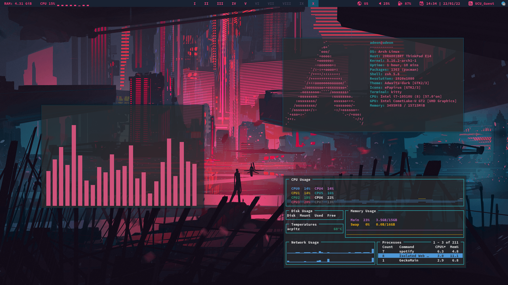

# Dotfiles

This is the repository with my _Arch Dotfiles_ and also my journey to make the **Perfect Rice**.

## About

I am currently using the **bspwm + polybar + kitty** setup, though both scripts have a lot of work to be done to them.

_What is already done:_
- Dual Monitor setup on bspwm(_just plug in the monitor and reload the bspwm_).
- Kitty is set up with a bit of transparency.
- Polybar shows _time, network, animated battery, locales, sound, brightness, real-time RAM and CPU load monitoring, temperature and fan speed._
- Zsh with _oh-my-zsh_ and a custom theming.
- Neofetch, which is colored to fit the rice.
- Ulauncher config(_though it will be replaced by rofi soon_)
- Some dunst notifications(like low battery)
- Rofi setup
- Some cool backgrounds.
- A bugged and definately not usable i3 script.
- `install.sh` script that can help you install the rice(has a description with the help of `./install.sh -h`)

_Some of the things I plan to add:_
- Microphone control.
- Better install script

_For more information check out **issues and projects**._

## Configuration

_If you have a fresh arch install - here is a [list](./config.md) of configuration steps and programs for you to refer to._

## ShowCase

_Here is how the rice currently looks(old image, not all monitors are present):_

**:D**
